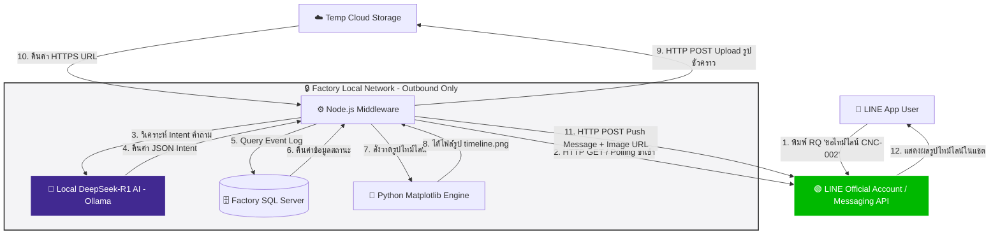

# 🚀 Jarvis Factory Timeline Bot (PoC Spec)

ระบบ AI ผู้ช่วยตอบกลับข้อมูลโรงงานอุตสาหกรรมแบบ Interactive (Request-Response) ผ่าน **LINE Official Account (LINE OA)** เพื่อแจ้งเตือนข้อความธรรมดา (Push-Only Text) ไปสู่การส่ง **รูปภาพสรุปไทม์ไลน์สถานะเครื่องจักร (Visual Timeline Graphic)** ช่วยให้วิศวกรและผู้บริหารอ่านสถานะการผลิตได้ทันทีในแชต 

ออกแบบมาให้ครอบคลุมแนวคิด **Outbound Polling (LINE Messaging API) + Local AI (DeepSeek) + Python Timeline Generator** รองรับการทำงานในเครือข่ายความปลอดภัยสูง (Outbound-Only Infrastructure)  โดยไม่ต้องเปิด Inbound Port ในโรงงาน

---

## 🏗 Architecture Overview

ระบบทำงานในรูปแบบ **Outbound Polling & Push Mechanism** เพื่อก้าวข้ามข้อจำกัดเรื่องการเปิด Inbound Port/Public IP ในโรงงาน:

```text
[ LINE App (User) ] 
       │ 1. พิมพ์คำถาม "ขอไทม์ไลน์ CNC-002"
       ▼
[ LINE Messaging API Server ]
       ▲
       │ 2. Polling (HTTP GET) ดึงข้อความเข้าโรงงาน
[ Node.js Middleware (Local Server) ]
       │
       ├──> 3. วิเคราะห์ Intent คำถาม ──> [ DeepSeek-R1 Local (Ollama) ]
       ├──> 4. ดึงข้อมูล Event Log ───> [ Factory SQL Server ]
       ├──> 5. วาดรูป Gantt Chart ───> [ Python (Matplotlib) ]
       └──> 6. ฝากไฟล์รูปชั่วคราว ────> [ Cloud / Temp File Server ]
       │
       │ 7. Push Image Message (HTTP POST)
       ▼
[ LINE App (User Receives Timeline Graphic) ]

```

## 🏗 Key Architecture & Security Concept

เนื่องจากเป็นโรงงานสาย Aerospace ที่ต้องปฏิบัติตามมาตรฐานความปลอดภัยข้อมูล (CMMC/DFARS) ระบบจึงถูกออกแบบให้รันบนเครือข่าย **Outbound-Only (ไร้ Inbound Port / ไร้ Public IP)** 100%:



## 💡 จุดเด่นของสถาปัตยกรรมนี้ (Core Highlights)

1. **ปลอดภัยระดับมาตรฐาน CMMC/DFARS:**
* **Local AI Processing:** ฐานข้อมูลโรงงานและ AI ประมวลผลภายในเซิร์ฟเวอร์ Local 100% ข้อมูลการผลิตไม่หลุดออกไปนอกโรงงาน
* **Outbound-Only Traffic:** ฝั่ง IT โรงงานไม่ต้องเปิด Inbound Port หรือขอ Public IP ใช้สิทธิ์ออกเน็ตพอร์ต HTTPS 443 เดิมแบบเดียวกับสคริปต์ส่งการแจ้งเตือนทั่วไป


2. **Interactive Pull Model (RQ Driven):**
* เปลี่ยนจากระบบเดิมที่ส่งเฉพาะ Text แจ้งเตือนสั้นๆ มาเป็นการให้ผู้ใช้พิมพ์ **"RQ (Request)"** เพื่อดึงกราฟและรายงานความเคลื่อนไหวได้ตลอด 24 ชั่วโมง


3. **Visual Insight:**
* สคริปต์ Python (`Matplotlib`) แปลงข้อมูล SQL Log เป็นแถบสีไทม์ไลน์ (Gantt Chart) ทำให้มองเห็นช่วงเวลาเครื่องจอด (Downtime) หรือติด Alarm ได้ในเสี้ยววินาที

---

## 🛠 Tech Stack

* **Frontend Gateway:** LINE Official Account (Messaging API)
* **Middleware Engine:** Node.js (V8 Runtime)
* **Local Intelligence:** Ollama (`deepseek-r1:1.5b` หรือ `deepseek-r1:7b`)
* **Data Visualization:** Python 3 (`matplotlib`, `pandas`)
* **Database:** Microsoft SQL Server / CIMCO / MDC Database
* **Messaging Gateway:** LINE Messaging API (Long Polling + Push API)

---

## 💻 Implementation Code Examples

### 1. Python Timeline Renderer (`render_timeline.py`)

สคริปต์วาดรูปไทม์ไลน์สีแสดงสถานะเครื่องจักร (Running, Alarm, Stop) แล้วบันทึกเป็นภาพ `.png`

```python
import matplotlib.pyplot as plt
import sys
import json

def generate_timeline(data_json, output_path="timeline_output.png"):
    data = json.loads(data_json)
    machine_name = data.get("machine_id", "CNC Machine")
    events = data.get("events", [])

    fig, ax = plt.subplots(figsize=(10, 2))

    # วาดแถบสถานะตามช่วงเวลา
    for ev in events:
        ax.barh(
            y=machine_name, 
            width=ev["duration"], 
            left=ev["start_hour"], 
            color=ev["color"], 
            height=0.4
        )

    ax.set_xlim(8, 17) # กำหนดช่วงเวลา เช่น 08:00 - 17:00
    ax.set_xlabel("Time (Hours)")
    ax.set_title(f"Status Timeline: {machine_name}")
    plt.tight_layout()
    plt.savefig(output_path, dpi=150)
    print(f"SUCCESS:{output_path}")

if __name__ == "__main__":
    # ตัวอย่างการรับ JSON String ผ่าน Argument
    if len(sys.argv) > 1:
        generate_timeline(sys.argv[1])
    else:
        # Mock Data สำหรับทดสอบ
        sample_data = json.dumps({
            "machine_id": "CNC-MAZ-2XN-002",
            "events": [
                {"start_hour": 8.0, "duration": 2.0, "color": "green", "status": "Running"},
                {"start_hour": 10.0, "duration": 0.5, "color": "red", "status": "Alarm"},
                {"start_hour": 10.5, "duration": 1.5, "color": "green", "status": "Running"},
                {"start_hour": 12.0, "duration": 1.0, "color": "black", "status": "Stop"},
                {"start_hour": 13.0, "duration": 3.5, "color": "green", "status": "Running"}
            ]
        })
        generate_timeline(sample_data)

```

---

### 2. DeepSeek Intent Analyzer (`aiService.js`)

ฟังก์ชัน Node.js ส่งคำถามภาษาคนเข้า Ollama Local เพื่อแปลงเป็นคำสั่ง JSON

```javascript
const axios = require('axios');

async function analyzeUserIntent(userText) {
  const prompt = `
    คุณคือระบบวิเคราะห์คำถามโรงงาน ให้แปลงคำถามผู้ใช้เป็น JSON เท่านั้น
    คำถาม: "${userText}"
    ตอบเฉพาะ JSON รูปแบบนี้:
    {
      "machine_id": "ชื่อเครื่องจักร",
      "requested_action": "get_timeline"
    }
  `;

  try {
    const response = await axios.post('http://localhost:11434/api/generate', {
      model: 'deepseek-r1:1.5b',
      prompt: prompt,
      stream: false,
      format: 'json'
    });

    return JSON.parse(response.data.response);
  } catch (error) {
    console.error('Ollama Error:', error);
    return null;
  }
}

module.exports = { analyzeUserIntent };

```

---

### 3. Outbound LINE Push Image (`lineService.js`)

สคริปต์ Node.js ส่งภาพไทม์ไลน์กลับไปยังผู้ใช้ (ทำงานแบบ Outbound POST 100% ไม่ต้องตั้ง Webhook ขาเข้า)

```javascript
const axios = require('axios');

const LINE_ACCESS_TOKEN = 'YOUR_LINE_CHANNEL_ACCESS_TOKEN';

async function pushImageToUser(userId, imageUrl) {
  const payload = {
    to: userId,
    messages: [
      {
        type: 'image',
        originalContentUrl: imageUrl,
        previewImageUrl: imageUrl
      }
    ]
  };

  try {
    const response = await axios.post(
      'https://api.line.me/v2/bot/message/push',
      payload,
      {
        headers: {
          'Content-Type': 'application/json',
          'Authorization': `Bearer ${LINE_ACCESS_TOKEN}`
        }
      }
    );
    console.log('Push Image Success:', response.status);
  } catch (error) {
    console.error('Error Pushing Image to LINE:', error.response?.data || error.message);
  }
}

module.exports = { pushImageToUser };

```

---

## 📋 Roadmaps to Presentation (2027)

* [x] **Phase 1: Architecture Validation** (ยืนยันสถาปัตยกรรม Outbound-Only ร่วมกับข้อกำหนด IT)
* [ ] **Phase 2: MVP Development** (พัฒนา PoC บน Local PC: Node.js + Ollama + Python Generator)
* [ ] **Phase 3: Database Integration** (เชื่อมต่อ SQL Server ดึง Event Log เครื่องจักรจริง)
* [ ] **Phase 4: Pilot Test** (เปิดทดลองใช้งานวงปิดร่วมกับทีมวิศวกรกะ)
* [ ] **Phase 5: Full Proposal Presentation** (สรุปสถิติ ผลลัพธ์ และนำเสนอผู้บริหาร/ลูกค้า)

---

