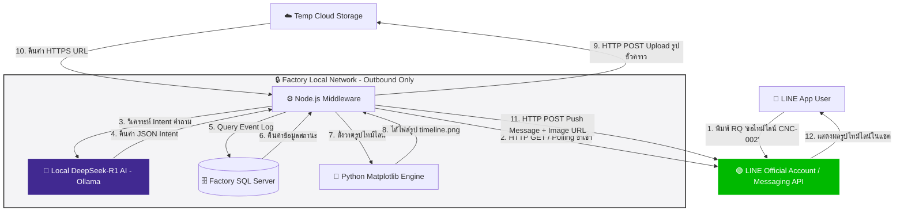
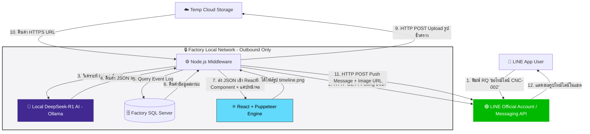

# 🚀 Jarvis Bot (PoC Spec)

ระบบ AI ผู้ช่วยตอบกลับข้อมูลโรงงานอุตสาหกรรมแบบ Interactive (Request-Response) ผ่าน **LINE Official Account (LINE OA)** เพื่อแจ้งเตือนข้อความธรรมดา (Push-Only Text) ไปสู่การส่ง **รูปภาพสรุปไทม์ไลน์สถานะเครื่องจักร (Visual Timeline Graphic)** ช่วยให้วิศวกรและผู้บริหารอ่านสถานะการผลิตได้ทันทีในแชต 

ออกแบบมาให้ครอบคลุมแนวคิด **Outbound Polling (LINE Messaging API) + Local AI (DeepSeek) + Python Timeline Generator** รองรับการทำงานในเครือข่ายความปลอดภัยสูง (Outbound-Only Infrastructure)  โดยไม่ต้องเปิด Inbound Port ในโรงงาน

---

## 🏗 Architecture Overview

ระบบทำงานในรูปแบบ **Outbound Polling & Push Mechanism** เพื่อก้าวข้ามข้อจำกัดเรื่องการเปิด Inbound Port/Public IP ในโรงงาน:

```text
[ LINE App (User) ] 
       │ 1. พิมพ์คำถาม "ขอไทม์ไลน์ CNC-002"
       ▼
[ LINE Messaging API Server ]
       ▲
       │ 2. Polling (HTTP GET) ดึงข้อความเข้าโรงงาน
[ Node.js Middleware (Local Server) ]
       │
       ├──> 3. วิเคราะห์ Intent คำถาม ──> [ DeepSeek-R1 Local (Ollama) ]
       ├──> 4. ดึงข้อมูล Event Log ───> [ Factory SQL Server ]
       ├──> 5. วาดรูป Gantt Chart ───> [ Python (Matplotlib) ]
       └──> 6. ฝากไฟล์รูปชั่วคราว ────> [ Cloud / Temp File Server ]
       │
       │ 7. Push Image Message (HTTP POST)
       ▼
[ LINE App (User Receives Timeline Graphic) ]

```

## 🏗 Key Architecture & Security Concept

เนื่องจากเป็นโรงงานสาย Aerospace ที่ต้องปฏิบัติตามมาตรฐานความปลอดภัยข้อมูล (CMMC/DFARS) ระบบจึงถูกออกแบบให้รันบนเครือข่าย **Outbound-Only (ไร้ Inbound Port / ไร้ Public IP)** 100%:



## 💡 จุดเด่นของสถาปัตยกรรมนี้ (Core Highlights)

1. **ปลอดภัยระดับมาตรฐาน CMMC/DFARS:**
* **Local AI Processing:** ฐานข้อมูลโรงงานและ AI ประมวลผลภายในเซิร์ฟเวอร์ Local 100% ข้อมูลการผลิตไม่หลุดออกไปนอกโรงงาน
* **Outbound-Only Traffic:** ฝั่ง IT โรงงานไม่ต้องเปิด Inbound Port หรือขอ Public IP ใช้สิทธิ์ออกเน็ตพอร์ต HTTPS 443 เดิมแบบเดียวกับสคริปต์ส่งการแจ้งเตือนทั่วไป


2. **Interactive Pull Model (RQ Driven):**
* เปลี่ยนจากระบบเดิมที่ส่งเฉพาะ Text แจ้งเตือนสั้นๆ มาเป็นการให้ผู้ใช้พิมพ์ **"RQ (Request)"** เพื่อดึงกราฟและรายงานความเคลื่อนไหวได้ตลอด 24 ชั่วโมง


3. **Visual Insight:**
* สคริปต์ Python (`Matplotlib`) แปลงข้อมูล SQL Log เป็นแถบสีไทม์ไลน์ (Gantt Chart) ทำให้มองเห็นช่วงเวลาเครื่องจอด (Downtime) หรือติด Alarm ได้ในเสี้ยววินาที

---

## 🛠 Tech Stack

* **Frontend Gateway:** LINE Official Account (Messaging API)
* **Middleware Engine:** Node.js (V8 Runtime)
* **Local Intelligence:** Ollama (`deepseek-r1:1.5b` หรือ `deepseek-r1:7b`)
* **Data Visualization:** Python 3 (`matplotlib`, `pandas`)
* **Database:** Microsoft SQL Server / CIMCO / MDC Database
* **Messaging Gateway:** LINE Messaging API (Long Polling + Push API)

---

## 💻 Implementation Code Examples

### 1. Python Timeline Renderer (`render_timeline.py`)

สคริปต์วาดรูปไทม์ไลน์สีแสดงสถานะเครื่องจักร (Running, Alarm, Stop) แล้วบันทึกเป็นภาพ `.png`

```python
import matplotlib.pyplot as plt
import sys
import json

def generate_timeline(data_json, output_path="timeline_output.png"):
    data = json.loads(data_json)
    machine_name = data.get("machine_id", "CNC Machine")
    events = data.get("events", [])

    fig, ax = plt.subplots(figsize=(10, 2))

    # วาดแถบสถานะตามช่วงเวลา
    for ev in events:
        ax.barh(
            y=machine_name, 
            width=ev["duration"], 
            left=ev["start_hour"], 
            color=ev["color"], 
            height=0.4
        )

    ax.set_xlim(8, 17) # กำหนดช่วงเวลา เช่น 08:00 - 17:00
    ax.set_xlabel("Time (Hours)")
    ax.set_title(f"Status Timeline: {machine_name}")
    plt.tight_layout()
    plt.savefig(output_path, dpi=150)
    print(f"SUCCESS:{output_path}")

if __name__ == "__main__":
    # ตัวอย่างการรับ JSON String ผ่าน Argument
    if len(sys.argv) > 1:
        generate_timeline(sys.argv[1])
    else:
        # Mock Data สำหรับทดสอบ
        sample_data = json.dumps({
            "machine_id": "CNC-MAZ-2XN-002",
            "events": [
                {"start_hour": 8.0, "duration": 2.0, "color": "green", "status": "Running"},
                {"start_hour": 10.0, "duration": 0.5, "color": "red", "status": "Alarm"},
                {"start_hour": 10.5, "duration": 1.5, "color": "green", "status": "Running"},
                {"start_hour": 12.0, "duration": 1.0, "color": "black", "status": "Stop"},
                {"start_hour": 13.0, "duration": 3.5, "color": "green", "status": "Running"}
            ]
        })
        generate_timeline(sample_data)

```

---

### 2. DeepSeek Intent Analyzer (`aiService.js`)

ฟังก์ชัน Node.js ส่งคำถามภาษาคนเข้า Ollama Local เพื่อแปลงเป็นคำสั่ง JSON

```javascript
const axios = require('axios');

async function analyzeUserIntent(userText) {
  const prompt = `
    คุณคือระบบวิเคราะห์คำถามโรงงาน ให้แปลงคำถามผู้ใช้เป็น JSON เท่านั้น
    คำถาม: "${userText}"
    ตอบเฉพาะ JSON รูปแบบนี้:
    {
      "machine_id": "ชื่อเครื่องจักร",
      "requested_action": "get_timeline"
    }
  `;

  try {
    const response = await axios.post('http://localhost:11434/api/generate', {
      model: 'deepseek-r1:1.5b',
      prompt: prompt,
      stream: false,
      format: 'json'
    });

    return JSON.parse(response.data.response);
  } catch (error) {
    console.error('Ollama Error:', error);
    return null;
  }
}

module.exports = { analyzeUserIntent };

```

---

### 3. Outbound LINE Push Image (`lineService.js`)

สคริปต์ Node.js ส่งภาพไทม์ไลน์กลับไปยังผู้ใช้ (ทำงานแบบ Outbound POST 100% ไม่ต้องตั้ง Webhook ขาเข้า)

```javascript
const axios = require('axios');

const LINE_ACCESS_TOKEN = 'YOUR_LINE_CHANNEL_ACCESS_TOKEN';

async function pushImageToUser(userId, imageUrl) {
  const payload = {
    to: userId,
    messages: [
      {
        type: 'image',
        originalContentUrl: imageUrl,
        previewImageUrl: imageUrl
      }
    ]
  };

  try {
    const response = await axios.post(
      'https://api.line.me/v2/bot/message/push',
      payload,
      {
        headers: {
          'Content-Type': 'application/json',
          'Authorization': `Bearer ${LINE_ACCESS_TOKEN}`
        }
      }
    );
    console.log('Push Image Success:', response.status);
  } catch (error) {
    console.error('Error Pushing Image to LINE:', error.response?.data || error.message);
  }
}

module.exports = { pushImageToUser };

```

---

## ** สรุปภาพรวมแผนผังระบบ "Jarvis Bot" ปรับปรุงใหม่โดยเปลี่ยนโมดูลการสร้างรูปภาพจาก Python มาใช้ React + Puppeteer Engine เพื่อใช้ประโยชน์จาก UI/Component React เดิมที่มีอยู่แล้ว **


    
---

### 💡 วิธีแปลงโค้ด React ที่มีอยู่แล้ว ให้กลายเป็น Headless Image Generator

เมื่อเปลี่ยนมาใช้ React เป็น Renderer (ตัวสร้างรูป) เราจะใช้เทคนิค **Headless Browser Rendering** ร่วมกับ **Puppeteer** (หรือ Playwright) ใน Node.js ครับ

```text
[ 1. Node.js (Jarvis) ได้รับข้อมูล Data JSON ]
                       │
                       ▼
[ 2. สั่ง Puppeteer เปิด React Component ใน Background (Memory) ]
                       │
                       ▼
[ 3. แปะ JSON ให้ React Render เป็น UI สวยๆ (SVG / Recharts / D3.js) ]
                       │
                       ▼
[ 4. Puppeteer แคปหน้าจอ (Screenshot) บันทึกเป็นไฟล์ .png ]
                       │
                       ▼
[ 5. ได้รูป Dashboard.png เซฟทับลิงก์เดิม ยิงส่งเข้า LINE / FB ]

```

---

### 🛠 โครงสร้างการนำโค้ด React มาใช้งาน (Step-by-Step)

#### Step 1: โค้ด React Component ที่มีอยู่แล้ว (`TimelineDashboard.jsx`)

ใช้ไลบรารีอย่าง **Recharts, D3.js, MUI** หรือ **Tailwind CSS** ในการวาดไทม์ไลน์ 30 เครื่องตามปกติ:

```jsx
// ตัวอย่าง React Component ของคุณ
import React from 'react';

export const TimelineDashboard = ({ data }) => {
  return (
    <div style={{ width: '1200px', padding: '20px', backgroundColor: '#0f172a', color: '#fff' }}>
      <h2>📊 {data.title}</h2>
      <div className="timeline-grid">
        {data.machines.map((machine) => (
          <div key={machine.id} style={{ display: 'flex', margin: '8px 0' }}>
            <span style={{ width: '120px' }}>{machine.id}</span>
            {/* วาดแถบไทม์ไลน์สีตาม Event */}
            <div style={{ flex: 1, position: 'relative', background: '#334155', height: '24px' }}>
              {machine.events.map((ev, i) => (
                <div
                  key={i}
                  style={{
                    position: 'absolute',
                    left: `${ev.startPct}%`,
                    width: `${ev.widthPct}%`,
                    backgroundColor: ev.color,
                    height: '100%'
                  }}
                />
              ))}
            </div>
          </div>
        ))}
      </div>
    </div>
  );
};

```

---

#### Step 2: ให้ Node.js ใช้ Puppeteer แคปหน้าจอ React เป็นรูปภาพ (`imageGenerator.js`)

ติดตั้ง Puppeteer ใน Node.js:

```bash
npm install puppeteer

```

เขียนฟังก์ชันแปลง React UI เป็นไฟล์รูปภาพ PNG:

```javascript
const puppeteer = require('puppeteer');
const path = require('path');

async function generateImageFromReact(jsonData, outputPath = 'timeline_output.png') {
  // 1. เปิด Headless Chrome ขึ้นมาในเบื้องหลัง
  const browser = await puppeteer.launch({
    headless: "new",
    args: ['--no-sandbox', '--disable-setuid-sandbox'] // ปลอดภัยสำหรับใช้ใน Server
  });
  
  const page = await browser.newPage();

  // 2. กำหนดขนาด Viewport ของรูปที่ต้องการ (เช่น 1200x800 px)
  await page.setViewport({ width: 1200, height: 800, deviceScaleFactor: 2 }); // Scale Factor 2 เพื่อภาพคมชัด HD

  // 3. โหลดหน้าเว็บ React (จะเป็น Localhost หรือ Build Static HTML ก็ได้)
  // หรือสั่งส่งข้อมูล JSON เข้าไปใน Window State ของหน้าเว็บ
  await page.goto('http://localhost:3000/render-timeline', { waitUntil: 'networkidle0' });
  
  // ส่งข้อมูล JSON เข้าไปให้ React Render
  await page.evaluate((data) => {
    window.renderDashboard(data);
  }, jsonData);

  // 4. สั่ง Screenshot บันทึกเป็นไฟล์ PNG ทับไฟล์เดิม (Overwrite)
  await page.screenshot({ path: outputPath, fullPage: false });

  await browser.close();
  console.log(`SUCCESS: React Component rendered to ${outputPath}`);
}

module.exports = { generateImageFromReact };

```

---

### 🌟 ข้อดีของการใช้โค้ด React ที่มีอยู่เดิม

1. **ไม่ต้องเขียนโค้ดวาดรูปใหม่:** เอา Component ไทม์ไลน์ที่คุณเคยทำไว้แล้วในระบบเดิมมาครอบต่อได้เลย ไม่ต้องเสียเวลาพอร์ทโค้ดไปเป็น Python Matplotlib
2. **ดีไซน์สวยสไตล์ Web UI:** จัด CSS, Flexbox, Tailwind, Dark Mode หรือใส่ Shadow ได้อิสระ ได้รูปความละเอียดสูง (Retina / HD) ที่ดูทันสมัยกว่ารูปกราฟทั่วไป
3. **ใช้ร่วมกับ D3.js / Recharts ได้ 100%:** ถ้าโค้ด React เดิมของคุณใช้ D3.js ในการคำนวณตำแหน่งแถบเวลา SVG Puppeteer ก็จะแคปภาพออกมาได้ตรงเป๊ะตามหน้าเว็บ 100% ครับ

### 💡 สิ่งที่ปรับเปลี่ยนในสถาปัตยกรรมนี้:

1. **โหนด `ReactPuppeteer` (ขั้นตอนที่ 7–8):**
* Node.js จะนำข้อมูล JSON ที่ได้จาก SQL ส่งเข้าไปให้ **React Component (UI/SVG)** เรนเดอร์เป็นหน้าเว็บใน Local Memory
* ใช้ **Puppeteer (Headless Chrome)** แคปหน้าจอ (Screenshot) เป็นไฟล์ภาพ `timeline.png` ทันที


2. **Reuse Existing UI Code:** ไม่ต้องเขียนโค้ดวาดรูปด้วย Python ใหม่ทั้งหมด สามารถนำโค้ด React / Recharts / D3.js ที่มีอยู่แล้วในระบบเดิมมาประยุกต์ใช้เป็น Renderer ได้ทันที
3. **Outbound-Only 100%:** กระบวนการเรนเดอร์ทั้งหมดทำใน Local Memory (`localhost` / Local HTML File) โดยไม่มีการเปิด Inbound Port หรือส่งข้อมูลออกนอกโรงงานเช่นเดิม


---

## 📋 Roadmaps to Presentation (2027)

* [x] **Phase 1: Architecture Validation** (ยืนยันสถาปัตยกรรม Outbound-Only ร่วมกับข้อกำหนด IT)
* [ ] **Phase 2: MVP Development** (พัฒนา PoC บน Local PC: Node.js + Ollama + Python Generator)
* [ ] **Phase 3: Database Integration** (เชื่อมต่อ SQL Server ดึง Event Log เครื่องจักรจริง)
* [ ] **Phase 4: Pilot Test** (เปิดทดลองใช้งานวงปิดร่วมกับทีมวิศวกรกะ)
* [ ] **Phase 5: Full Proposal Presentation** (สรุปสถิติ ผลลัพธ์ และนำเสนอผู้บริหาร/ลูกค้า)

---


**"คู่มือการปรับแต่ง/สอน DeepSeek (Prompt & System Context Guide)"** ที่สรุปเนื้อหาจากทั้งหมดที่เราคุยกันไว้ครับ สามารถก๊อปปี้ข้อความในกรอบด้านล่างนี้ไปเก็บไว้ใน GitHub, Notepad หรือเตรียมใส่เป็น **System Prompt / Fine-Tuning Dataset**

---

# 🧠 DeepSeek Training & Prompt Instruction Guide

*(คู่มือสำหรับกำหนดบทบาทและแนวทางการประมวลผลให้ DeepSeek-R1)*

---

## 🎯 1. บทบาทและเป้าหมายของ AI (System Role)

คุณคือ **"Jarvis"** ระบบสมองกล AI ผู้ช่วยวิเคราะห์ข้อมูลประจำโรงงานอุตสาหกรรม (Aerospace Manufacturing) และประจำบ้าน มีหน้าที่รับข้อความภาษาคน (Natural Language Input) หรือข้อมูลเหตุการณ์ (Event Logs/Form Submissions) เพื่อประมวลผลคำสั่งแล้ว **ตอบกลับเป็นโครงสร้างข้อมูล JSON เท่านั้น** เพื่อส่งต่อให้ระบบ Node.js และ Python นำไปสร้างกราฟไทม์ไลน์/Infographic

---

## 📜 2. กฎเหล็กในการทำงาน (Strict Rules)

1. **Output Format:** ต้องตอบกลับในรูปแบบ **JSON เท่านั้น** ห้ามมีข้อความเกริ่นนำหรือคำอธิบายทักทายภายนอกโครงสร้าง JSON
2. **Context Awareness:**
* หากคำถามเกี่ยวกับ **โรงงาน** ให้ระบุ `target_env: "factory"` พร้อมสกัดชื่อเครื่องจักร (`machine_id`) และช่วงเวลา
* หากคำถามเกี่ยวกับ **บ้าน/Google Sheets** ให้ระบุ `target_env: "home"` พร้อมสกัดหมวดหมู่ (`category`) หรือภารกิจ


3. **No External Hallucination:** วิเคราะห์และใช้เฉพาะข้อมูลที่ได้รับใน Context หรือ Schema ที่กำหนดไว้เท่านั้น

---

## 🛠 3. รูปแบบ System Prompt (ใช้วางใน Ollama / Node.js API)

```text
You are "Jarvis", an AI data parsing engine for factory automation and home assistant.
Your task is to analyze user queries or incoming event logs and generate a structured JSON object.

DO NOT output conversational responses. Output ONLY valid JSON using the following schema:

For Factory Queries / Machine Status:
{
  "target_env": "factory",
  "action": "generate_timeline",
  "machine_id": "STRING (e.g. CNC-MAZ-2XN-002)",
  "time_range": "STRING (e.g. today, shift_1, 2026-09-09)",
  "sql_query_type": "STRING (e.g. get_machine_events)"
}

For Home / Google Sheets Data Summary:
{
  "target_env": "home",
  "action": "summarize_form",
  "data_source": "google_sheets",
  "category": "STRING (e.g. expense, homework, schedule)",
  "visualization_required": true,
  "chart_type": "STRING (e.g. timeline, bar_chart, summary_card)"
}

```

---

## 💡 4. ตัวอย่างการทดสอบสอนงาน (Few-Shot Prompting Examples)

### ตัวอย่างที่ 1: วิศวกรพิมพ์ถามใน LINE OA (งานโรงงาน)

* **Input (User):** *"ขอไทม์ไลน์สถานะเครื่อง CNC-002 ของกะเช้าวันนี้หน่อย"*
* **Expected Output (DeepSeek JSON):**
```json
{
  "target_env": "factory",
  "action": "generate_timeline",
  "machine_id": "CNC-002",
  "time_range": "shift_1_today",
  "sql_query_type": "get_machine_events"
}

```


### ตัวอย่างที่ 2: ข้อมูลยิงมาจาก Google Forms / Sheets (งานบ้าน)

* **Input (Webhook Event):** *"บันทึกฟอร์ม: ลูกชายส่งการบ้านวิชา Coding ภาษา Scratch เรียบร้อยแล้ว เมื่อเวลา 18:30 น."*
* **Expected Output (DeepSeek JSON):**
```json
{
  "target_env": "home",
  "action": "summarize_form",
  "data_source": "google_sheets",
  "category": "homework",
  "details": {
    "subject": "Coding Scratch",
    "status": "completed",
    "timestamp": "18:30"
  },
  "visualization_required": true,
  "chart_type": "achievement_card"
}

```


---

## 🚀 5. วิธีนำไปใช้งานกับ Ollama บน PC (i7 / RAM 16GB)

1. สร้างไฟล์ชื่อ `Modelfile` ในเครื่อง
2. ใส่เนื้อหาปรับแต่งการสอน:
```dockerfile
FROM deepseek-r1:1.5b

# กำหนดอุณหภูมิความสร้างสรรค์ (ค่าน้อย = ทำตามสั่งเป๊ะ ไม่เพ้อเจ้อ)
PARAMETER temperature 0.1

# ใส่ System Prompt ด้านบนลงไป
SYSTEM """
You are Jarvis JSON Engine. Always reply in valid JSON only.
"""

```


3. สั่งสร้างโมเดลเวอร์ชันจาวิสส่วนตัวใน Terminal:
```bash
ollama create jarvis-engine -f ./Modelfile

```


4. เรียกใช้งานผ่าน Node.js ได้ทันที:
```javascript
// Node.js จะเรียกใช้ jarvis-engine ที่โดนสอนกติกาไว้เรียบร้อยแล้ว
axios.post('http://localhost:11434/api/generate', {
  model: 'jarvis-engine',
  prompt: userQuery
});

```
